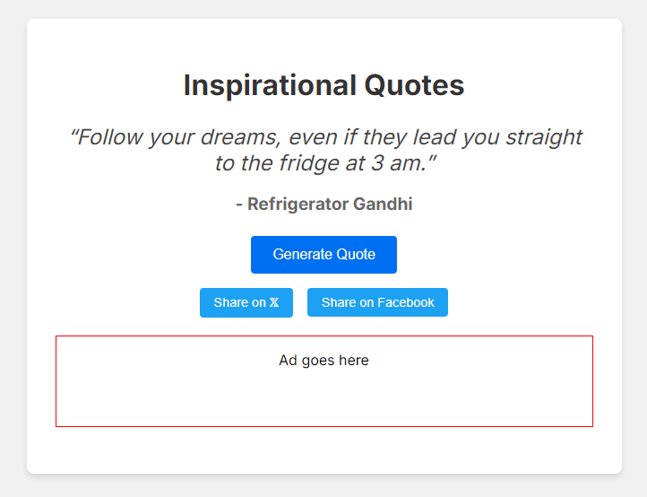

# Funny Inspirational Quote Generator


This project is a NextJS application that generates funny inspirational quotes using the OpenAI API. It creates quotes that sound profound but are actually nonsensical, along with humorous attributions to random famous people.

## Setup

1. Clone the repository
2. Install dependencies:
   ```
   npm install
   ```
3. Create a `.env.local` file in the root directory and add your OpenAI API key:
   ```
   NEXT_PUBLIC_OPENAI_API_KEY=your_openai_api_key_here
   ```
4. Run the development server:
   ```
   npm run dev
   ```
5. Open [http://localhost:3000](http://localhost:3000) in your browser to see the application.

## Features

- Generate funny inspirational quotes
- Share quotes on 𝕏 and Facebook
- Loading states
- Ads

## Technologies Used

- NextJS 13+
- React
- TypeScript
- OpenAI API (GPT-4 model)
- Google Adsense

## License

This project is open source and available under the [GPL-3.0 License](LICENSE).
